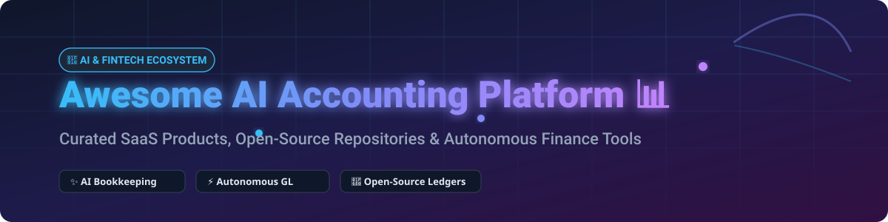

<p align="center">
  
</p>

# 📊 Awesome AI Accounting Platform 🤖

[](https://github.com/ishandutta2007/Awesome-Awesome-Awesome) <a href="https://discord.gg/jc4xtF58Ve"></a> [](https://github.com/ishandutta2007/Awesome-AI-Accounting-Platform) [](LICENSE) <a href="https://github.com/ishandutta2007"></a>

> ⚡ **A curated directory of AI-powered accounting SaaS platforms, autonomous bookkeeping software, intelligent ERP connectors, and open-source double-entry financial tools.**

---

## 💡 Ecosystem Market Insights & Overview

> 📈 **Estimated Market Size & Structure**: The global AI in Accounting and Fintech market size was valued at **$3.2 Billion in 2024** and is projected to reach **$16.8 Billion by 2032**, growing at a CAGR of ~23.5%. The sector is currently **moderately fragmented**, featuring fast-moving VC-backed startups (Rillet, Vic.ai, Numeric) alongside legacy ERP giants (NetSuite, QuickBooks, SAP) layering AI capabilities. While niche market leaders dominate close-management and AP/AR automation, standard open API protocols make multi-tool interoperability common rather than a pure winner-take-all dynamics.

---

## 📑 Table of Contents
- [🏢 SaaS/Hosted Platforms](#-saashosted-platforms)
- [🔓 Open-Source GitHub Projects](#-open-source-github-projects)
- [🛠️ Architecture & Composable Stacks](#%EF%B8%8F-architecture--composable-stacks)
- [🤝 How to Contribute](#-how-to-contribute)
- [☕ Support](#-support)
- [📈 Star History](#-star-history)
- [⚠️ Disclaimer](#%EF%B8%8F-disclaimer)

---

## 🏢 SaaS/Hosted Platforms

*Sorted by total funding raised / estimated valuation (descending)* 🔽

| Platform 🚀 | Key Features & Focus 🎯 | Valuation / Funding 💰 | Starting Price 💵 | Free Tier / Trial Limit 🆓 |
| :--- | :--- | :--- | :--- | :--- |
| **[Vic.ai](https://www.vic.ai/)** | Autonomous AP processing, PO matching, intelligent invoice approval workflows & audit trail. | **$208M Valuation** ($115M raised) | Custom quotes (~$1,000+/mo enterprise) | No free tier (Demo-based access) |
| **[Rillet](https://www.rillet.com/)** | AI-native ERP for high-growth tech startups with real-time revenue recognition & multi-currency ledger. | **~$150M Est. Val** ($95M raised) | Custom quotes (Based on volume/complexity) | No free tier (Personalized live demo) |
| **[Numeric](https://www.numeric.io/)** | AI close management, automated balance sheet reconciliations & financial reporting assistant. | **~$120M Est. Val** ($89M raised) | **$30 / user / month** (Essentials) | 14-day full platform access trial |
| **[Docyt](https://docyt.com/)** | AI-driven expense management, continuous bookkeeping & multi-location restaurant/retail GL. | **~$60M Est. Val** ($27.2M raised) | **$299 / month** (Mini Core plan) | 14-day free trial limit |
| **[Digits](https://digits.com/)** | Real-time financial reports, AI transaction analysis & interactive chart of accounts dashboard. | **~$50M Est. Val** ($32M raised) | **$100 / business / month** | 30-day full access free trial |
| **[Osfin AI](https://osfin.ai/)** | Automated bank reconciliation, marketplace settlement reconciliation & payout tracking. | **~$25M Est. Val** ($9.9M raised) | Custom quotes (Volume-based pricing) | No free trial (Request private demo) |
| **[Booke AI](https://booke.ai/)** | OCR receipt parsing, AI categorization for QuickBooks/Xero & robotic data extraction. | Private (~$5M funding) | **$35 / month** (Smart plan) | 30-day free trial (Up to 30 tasks) |
| **[Puzzle](https://www.puzzle.io/)** | Autonomous double-entry ledger built for startups with tax-readiness & cap-table tracking. | Private (~$15M funding) | **$30 / month** (Software core) | 14-day free trial (Core software) |
| **[Truewind](https://www.truewind.ai/)** | AI-powered fractional CFO services, automated bookkeeping & month-end closing package. | Private (~$3M funding) | Custom quotes (Starts ~$500/mo) | No free trial (Sales demo required) |

---

## 🔓 Open-Source GitHub Projects

*Sorted by GitHub Star count (descending)* 🔽

- **[frappe/erpnext](https://github.com/frappe/erpnext)** [](https://github.com/frappe/erpnext/stargazers)  
  📦 Full-featured open-source ERP system containing double-entry accounting, invoicing, asset management, and multi-currency ledgers. Supports custom AI LLM connectors via REST API.

- **[firefly-iii/firefly-iii](https://github.com/firefly-iii/firefly-iii)** [](https://github.com/firefly-iii/firefly-iii/stargazers)  
  💸 Self-hosted personal & small business financial manager with double-entry support, budget rules, transaction recurring engine, and automated API import hooks.

- **[simonw/llm](https://github.com/simonw/llm)** [](https://github.com/simonw/llm/stargazers)  
  🧠 CLI utility and Python library for running LLM prompts—frequently utilized in open-source AI accounting scripts to auto-categorize bank statements and parse CSV ledgers.

- **[beancount/beancount](https://github.com/beancount/beancount)** [](https://github.com/beancount/beancount/stargazers)  
  📝 Double-entry command-line accounting engine using plain text files. Highly customizable with Python AI models for receipt OCR and transaction classification.

- **[invoiceninja/invoiceninja](https://github.com/invoiceninja/invoiceninja)** [](https://github.com/invoiceninja/invoiceninja/stargazers)  
  🧾 Open-source invoicing, expense tracking, and online payment platform designed for freelancers and SMBs with web & mobile client applications.

- **[mindee/doctr](https://github.com/mindee/doctr)** [](https://github.com/mindee/doctr/stargazers)  
  📄 Deep-learning OCR library for Python & PyTorch/TensorFlow, used to extract structured financial data from invoice and receipt PDFs into double-entry ledgers.

- **[akaunting/akaunting](https://github.com/akaunting/akaunting)** [](https://github.com/akaunting/akaunting/stargazers)  
  💻 Modular online accounting software for small businesses with invoice creation, vendor bill tracking, modular app store, and AI integration plugins.

- **[ledger/ledger](https://github.com/ledger/ledger)** [](https://github.com/ledger/ledger/stargazers)  
  ⚙️ Powerful command-line double-entry accounting system that inspires plain-text finance workflows and automated shell scripting pipelines.

- **[gnucash/gnucash](https://github.com/gnucash/gnucash)** [](https://github.com/gnucash/gnucash/stargazers)  
  🏛️ Classic open-source personal and small-business financial accounting software featuring QIF/OFX import, customer/vendor tracking, and scheduled transactions.

- **[avansaber/erpclaw](https://github.com/avansaber/erpclaw)** [](https://github.com/avansaber/erpclaw/stargazers)  
  🤖 Experimental AI-native ERP system operated via plain language text prompts for double-entry bookkeeping, inventory, sales, and purchasing modules.

- **[WisdmLabs/ledgermind](https://github.com/WisdmLabs/ledgermind)** [](https://github.com/WisdmLabs/ledgermind/stargazers)  
  🔗 Open ERPNext plugin connecting financial ledgers to AI close assistance, general ledger auto-coding, and human-in-the-loop validation tools.

---

## 🛠️ Architecture & Composable Stacks

```
  ┌─────────────────┐       ┌──────────────────────┐       ┌────────────────────────┐
  │ 📄 Document AI   │ ────> │  🤖 LLM Classifier   │ ────> │  🏛️ Double-Entry Core │
  │  (docTR / OCR)  │       │ (LedgerMind / Custom)│       │ (ERPNext / Firefly III)│
  └─────────────────┘       └──────────────────────┘       └────────────────────────┘
```

1. **Document Parsing**: Extract raw fields from invoice/receipt images using open OCR (`doctr`).
2. **AI Transaction Categorization**: Route normalized JSON data into an LLM (`llm` or custom OpenAI/Claude prompt) for chart-of-accounts mapping.
3. **Ledger Posting**: Push verified journal entries into self-hosted engines (`ERPNext`, `Firefly III`, or `Beancount`).

---

## 🤝 How to Contribute

Contributions are highly appreciated! 💖
1. 🍴 **Fork** this repository.
2. 📝 **Add/Update** details in `README.md` following the existing format.
3. 🔗 Check out curated lists at [Awesome-Awesome-Awesome](https://github.com/ishandutta2007/Awesome-Awesome-Awesome).
4. 🚀 **Open a Pull Request** with a brief summary of additions.

---

## ☕ Support

Thank you for exploring this curated repository! If you find this resource helpful for building or selecting your AI accounting system, please consider showing your support:

* ⭐ **Star** this repository to help others discover it!
* 🍴 **Fork** it to keep your own reference copy.
* 📢 **Share** it with fellow developers, CFOs, and finance operators!
* ☕ **Sponsor / Buy a Coffee**: Consider supporting ongoing open-source curation via the [GitHub Sponsor Dashboard](https://github.com/sponsors/ishandutta2007).

---

## 📈 Star History

[](https://star-history.dera.page/#ishandutta2007/Awesome-AI-Accounting-Platform&type=date&legend=top-left)

---

## ⚠️ Disclaimer

- This repository is a **community-curated list** for informational and educational purposes.
- Autonomous AI models for bookkeeping can hallucinate or misclassify transactions. All financial postings, tax filings, and general ledger operations must be audited and signed off by qualified human accountants or certified controllers.
